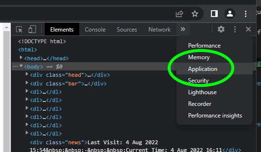
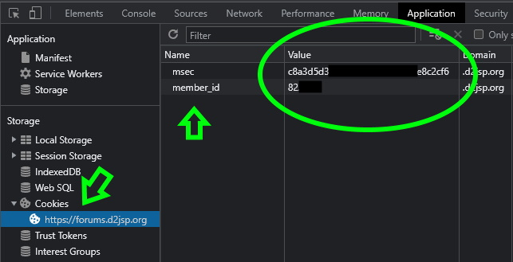

# Forum Gold Notifier (d2jsp)

## How to run
1. Open https://forums.d2jsp.org on your browser and login.
2. Press F12 on your keyboard to open the developer menu.
3. Swap to the 'Application' tab for Chrome or 'Storage' for Firefox
4. Click on 'Cookies' and note down the value for 'msec' and 'member_id'
5. Open up settings.json and change the values for 'MSec' and 'MemberId' with the values you noted down.
6. Start FgNotifier.exe

